# Ongo Weight Loss — Complete Patient Onboarding & Clinical Intake Flow

A responsive, production-ready, full 25-screen telehealth onboarding and clinical intake web application for **Ongo Weight Loss**, built with React 19, Vite, and a custom Vanilla CSS design system.

---

## 🌟 Architecture & Flow Overview

The onboarding journey guides prospective patients through **10 structured phases**, providing clinical qualification, doctor matching, flexible plan selection, checkout, and an in-depth 13-step medical intake with telehealth scheduling.

```mermaid
graph TD
    S1["Screen 1: Create Account"] --> S2["Screen 2: Tell Us About You"]
    S2 --> S3["Screen 3: BMI / Starting Point"]
    S3 --> S4["Screen 4: Safety Checks"]
    S4 --> S5["Screen 5: GLP-1 History?"]
    S5 -->|Yes| S5a["Screen 5.1: Which GLP-1?"]
    S5 -->|No| S6["Screen 6: Initial Result"]
    S5a --> S5b["Screen 5.2: Dose & Frequency"]
    S5b --> S5c["Screen 5.3: Tolerance & Experience"]
    S5c --> S5d["Screen 5.4: Upload Prescription"]
    S5d --> S6
    S6 --> S7["Screen 7: Meet Physician"]
    S7 --> S8["Screen 8: Treatment Options"]
    S8 --> S9["Screen 9: Choose Plan"]
    S9 --> S10["Screen 10: Complete Payment"]
    S10 --> S11["Screen 11: Payment Confirmed"]
    S11 --> S12["Screen 12: Health Conditions (Step 1/13)"]
    S12 --> S13["Screen 13: Medications (Step 2/13)"]
    S13 --> S14["Screen 14: Allergies (Step 3/13)"]
    S14 --> S15["Screen 15: Weight Journey (Step 4/13)"]
    S15 --> S16["Screen 16: Past Attempts (Step 5/13)"]
    S16 --> S17["Screen 17: Weight-Loss Surgery (Step 6/13)"]
    S17 --> S18["Screen 18: Motivation (Step 7/13)"]
    S18 --> S19["Screen 19: Daily Routine (Step 8/13)"]
    S19 --> S20["Screen 20: Lifestyle (Step 9/13)"]
    S20 --> S21["Screen 21: Ethnicity (Step 10/13)"]
    S21 --> S22["Screen 22: Photo ID (Step 11/13)"]
    S22 --> S23["Screen 23: Shipping (Step 12/13)"]
    S23 --> S24["Screen 24: Appointment (Step 13/13)"]
    S24 --> S25["Screen 25: Intake Confirmed"]
```



---

## 📋 Comprehensive 25-Screen Breakdown

### Phase 1: Get Started
- **Screen 1 — Create Your Ongo Account**: Email & password inputs with show/hide eye toggle, required legal agreement, styled optional newsletter checkbox, and Google OAuth option.
- **Screen 2 — Tell Us About You**: Optimized personal profile form with First Name, Last Name, Date of Birth, Gender, Phone Number, and State picker with themed dropdowns.
- **Screen 3 — Check Your Starting Point**: Interactive Imperial/Metric BMI Calculator featuring a live SVG gauge dial, dynamic classification needle, and clinical category badges.

### Phase 2: Initial Clinical Screening
- **Screen 4 — Important Health Questions**: 10 primary contraindication screenings (pregnancy, pancreatitis, MTC, dialysis, etc.) with active-checked highlighted states and a 1-click "None of these apply to me" toggle.
- **Screen 5 — GLP-1 History**: Pre-qualifying question branching into detailed history for previous users or advancing new patients directly to assessment results.
  - **Branch 5.1 — Which GLP-1 Medication**: Multi-select chip grid (Ozempic, Wegovy, Mounjaro, Zepbound, Rybelsus, Compounded GLP-1, etc.).
  - **Branch 5.2 — Dose & Frequency**: Single-select dose amounts (0.25mg to 5.0mg, custom unit input) and frequency chips.
  - **Branch 5.3 — GLP-1 Experience**: Overall tolerance rating, primary reason for stopping, and date last taken.
  - **Branch 5.4 — Upload Previous Prescription**: Drag-and-drop file upload zone for prescription label verification with skip option.

### Phase 3: Confidence & Clinical Trust
- **Screen 6 — Your Initial Result**: Preliminary GLP-1 candidate milestone with a 4-step care pathway breakdown and clinical safety disclaimer.
- **Screen 7 — Meet Your Physician**: Doctor credential card (Dr. Sarah Jenkins, MD, FACP) with state licensing badge and centered telehealth reassurance (*"100% Virtual Care — No in-person visit required"*).
- **Screen 8 — Explore Treatment Options**: Selectable GLP-1 treatment formulations (Compounded Semaglutide, Tirzepatide, Chewables, Oral Drops, or Physician's Choice).

### Phase 4: Treatment Plan & Payment
- **Screen 9 — Choose Your Treatment Plan**: 1-Month Kickstart ($249), 3-Month Momentum ($199/mo, Save $50/mo — Recommended), and 6-Month Transform ($179/mo), backed by Ongo's Full-Refund Guarantee.
- **Screen 10 — Complete Your Payment**: Card, Apple Pay, and Google Pay tabs, promo code support (`ONGO50`), multi-month 30% savings, and transparent order summary with strikethrough shipping (`~~$23~~ FREE`).
- **Screen 11 — Payment Confirmed 🎉**: Confetti celebration, order receipt details, and clear progression roadmap to clinical intake.

### Phase 5: Comprehensive Clinical Intake (13 Steps)
- **Screen 12 (Step 1 of 13) — Tell Us About Your Health**: 16 clinical conditions multi-select grid with female-conditional PCOS option, other text input, and "None of these apply" fast-track.
- **Screen 13 (Step 2 of 13) — Medications**: Prescriptions, OTC, and supplements Yes/No toggle with dynamic list input.
- **Screen 14 (Step 3 of 13) — Allergies**: Known drug, food, or environmental allergies Yes/No toggle with reaction details.
- **Screen 15 (Step 4 of 13) — Weight Journey**: Highest adult weight, lowest in past 5 years, goal weight, and optional waist circumference.
- **Screen 16 (Step 5 of 13) — Past Attempts**: Multi-select cards for past weight-loss efforts (keto, fasting, calorie tracking, gym, medications).
- **Screen 17 (Step 6 of 13) — Weight-Loss Surgery**: Bariatric surgery screening (lap band, gastric sleeve, bypass, other) with conditional disclosure.

### Phase 6: Goals & Motivation
- **Screen 18 (Step 7 of 13) — What's Driving You Right Now?**: Key personal motivations (confidence, energy, health markers, cravings, diabetes prevention) with highlight styling.

### Phase 7: Lifestyle & Habits
- **Screen 19 (Step 8 of 13) — Daily Routine**: Themed dropdowns for daily meals, water intake, sleep duration, and exercise frequency.
- **Screen 20 (Step 9 of 13) — Lifestyle & Wellness**: Dropdowns for fast food, sugary drinks, alcohol, recreational substances, plus an interactive 1–10 stress slider.
- **Screen 21 (Step 10 of 13) — Ethnicity**: Clean demographic single-select list with right-aligned selection badges.

### Phase 8: Verification & Fulfillment
- **Screen 22 (Step 11 of 13) — Verify Your Identity**: Government-issued photo ID upload or camera capture with HIPAA privacy reassurance.
- **Screen 23 (Step 12 of 13) — Shipping Information**: Discreet home delivery address inputs with 50-state dropdown.

### Phase 9: Telehealth Appointment
- **Screen 24 (Step 13 of 13) — Book Your Consultation**: Interactive weekday calendar with local timezone detection and real-time slot selection.

### Phase 10: Confirmation
- **Screen 25 — Appointment Confirmed 🎉**: Confetti confirmation, appointment summary card, next-steps timeline, and link to patient dashboard.

---

## ⚡ Recent Enhancements & Design Updates

1. **Streamlined 25-Screen Architecture**:
   - Removed the redundant weight loss goal screen.
   - Streamlined Phase 5 clinical intake to **13 clean steps**.
   - Synchronized all component files (`Screen18Motivation.jsx` through `Screen25IntakeConfirmed.jsx`) and internal routes.
2. **Highlighted Checkbox Selection**:
   - Checkbox cards now feature high-contrast active states with `#EEF8EC` light mint background, `#2F8968` border, and bolded typography.
3. **Centered Reassurance Banner (Screen 7)**:
   - "100% Virtual Care — No in-person visit required" banner is centered with physician credentials.
4. **Optimized Screen 2 Input Order**:
   - Restructured fields: First Name, Last Name, Date of Birth, Gender, Phone Number, State.
5. **Screen 1 Optional Marketing Checkbox**:
   - "Send me the latest news, treatment tips, and offers" clearly badged as optional.
6. **Screen 10 Shipping Fee Strikethrough**:
   - Order summary displays standard shipping fee as `~~$23~~ FREE`.
7. **Screen 12 Medical History Clarification**:
   - Header clearly communicates comprehensive health condition evaluation.
8. **URL Query Routing & Direct Linking**:
   - Support for `?screen={id}`, `?autofill=1`, and `?mobile=true` for instant testing and deep linking.

---

## 📸 Screenshots Gallery

All screens are captured in high resolution and available in [`screenshots/`](./screenshots/):

| Step | Screen | Preview Image |
|:---:|---|:---:|
| 1 | Screen 1: Create Account | [`01_screen1_account.png`](./screenshots/01_screen1_account.png) |
| 2 | Screen 2: About You | [`02_screen2_about_you.png`](./screenshots/02_screen2_about_you.png) |
| 3 | Screen 3: BMI Calculator | [`03_screen3_starting_point.png`](./screenshots/03_screen3_starting_point.png) |
| 4 | Screen 4: Health Questions | [`04_screen4_health_questions.png`](./screenshots/04_screen4_health_questions.png) |
| 5 | Screen 5: GLP-1 History | [`05_screen5_glp1_history.png`](./screenshots/05_screen5_glp1_history.png) |
| 5.1 | Branch 5.1: Medication Selection | [`05_branch1_medications.png`](./screenshots/05_branch1_medications.png) |
| 5.2 | Branch 5.2: Dosage & Schedule | [`05_branch2_dosage.png`](./screenshots/05_branch2_dosage.png) |
| 5.3 | Branch 5.3: Experience & Tolerance | [`05_branch3_experience.png`](./screenshots/05_branch3_experience.png) |
| 5.4 | Branch 5.4: Prescription Upload | [`05_branch4_prescription.png`](./screenshots/05_branch4_prescription.png) |
| 6 | Screen 6: Initial Result | [`06_screen6_initial_result.png`](./screenshots/06_screen6_initial_result.png) |
| 7 | Screen 7: Meet Your Physician | [`07_screen7_meet_physician.png`](./screenshots/07_screen7_meet_physician.png) |
| 8 | Screen 8: Treatment Options | [`08_screen8_treatment_options.png`](./screenshots/08_screen8_treatment_options.png) |
| 9 | Screen 9: Treatment Plan | [`09_screen9_treatment_plan.png`](./screenshots/09_screen9_treatment_plan.png) |
| 10 | Screen 10: Complete Payment | [`10_screen10_payment.png`](./screenshots/10_screen10_payment.png) |
| 11 | Screen 11: Payment Confirmed | [`11_screen11_payment_confirmed.png`](./screenshots/11_screen11_payment_confirmed.png) |
| 12 | Screen 12: Health Conditions (Step 1/13) | [`12_screen12_health_conditions.png`](./screenshots/12_screen12_health_conditions.png) |
| 13 | Screen 13: Medications (Step 2/13) | [`13_screen13_medications.png`](./screenshots/13_screen13_medications.png) |
| 14 | Screen 14: Allergies (Step 3/13) | [`14_screen14_allergies.png`](./screenshots/14_screen14_allergies.png) |
| 15 | Screen 15: Weight Journey (Step 4/13) | [`15_screen15_weight_journey.png`](./screenshots/15_screen15_weight_journey.png) |
| 16 | Screen 16: Past Attempts (Step 5/13) | [`16_screen16_weight_loss_attempts.png`](./screenshots/16_screen16_weight_loss_attempts.png) |
| 17 | Screen 17: Weight-Loss Surgery (Step 6/13) | [`17_screen17_weight_loss_surgery.png`](./screenshots/17_screen17_weight_loss_surgery.png) |
| 18 | Screen 18: Motivation (Step 7/13) | [`18_screen18_motivation.png`](./screenshots/18_screen18_motivation.png) |
| 19 | Screen 19: Daily Routine (Step 8/13) | [`19_screen19_daily_routine.png`](./screenshots/19_screen19_daily_routine.png) |
| 20 | Screen 20: Lifestyle (Step 9/13) | [`20_screen20_lifestyle.png`](./screenshots/20_screen20_lifestyle.png) |
| 21 | Screen 21: Ethnicity (Step 10/13) | [`21_screen21_ethnicity.png`](./screenshots/21_screen21_ethnicity.png) |
| 22 | Screen 22: Photo ID (Step 11/13) | [`22_screen22_photo_id.png`](./screenshots/22_screen22_photo_id.png) |
| 23 | Screen 23: Shipping (Step 12/13) | [`23_screen23_shipping.png`](./screenshots/23_screen23_shipping.png) |
| 24 | Screen 24: Appointment (Step 13/13) | [`24_screen24_appointment.png`](./screenshots/24_screen24_appointment.png) |
| 25 | Screen 25: Intake Confirmed | [`25_screen25_intake_confirmed.png`](./screenshots/25_screen25_intake_confirmed.png) |

---

## 🎨 Design System & Color Tokens

| Token Name | Value | Usage |
|---|---|---|
| `--color-primary-dark` | `#174B38` | Header background & dark branding |
| `--color-primary-forest` | `#1F4F3D` | Primary headings & active state text |
| `--color-accent-teal` | `#2F8968` | Checkmarks, active borders, progress tags |
| `--color-active-pale` | `#EEF8EC` | Active card & checkbox background |
| `--color-border-active` | `#6DBA91` | Focused and selected card borders |
| `--color-cta-button` | `#11110F` | Main call-to-action button |
| `--color-cream-bg` | `#FAF8F5` | Main card inner background |
| `--font-family` | `Manrope`, sans-serif | Primary typography |

---

## 🛠️ Reviewer Controls

The application includes a built-in top inspector toolbar for rapid evaluation:
- **Screen Selector**: Jump to any of the 25 screens or 4 branches instantly.
- **Autofill Demo**: Auto-populates realistic clinical and address data across all fields.
- **Mobile Frame**: Toggles between 540px desktop card and 390px mobile viewport frame.
- **Direct Deep-Linking**:
  - `http://localhost:5173/?screen=7` — Open Screen 7 directly
  - `http://localhost:5173/?screen=10&autofill=1` — Open Screen 10 with filled payment and promo
  - `http://localhost:5173/?screen=24&mobile=true` — Open Screen 24 in mobile frame

---

## 🚀 Running Locally

```bash
# 1. Install dependencies
npm install

# 2. Start local development server
npm run dev

# 3. Build production bundle
npm run build
```

Dev server runs locally at: `http://localhost:5173/`
